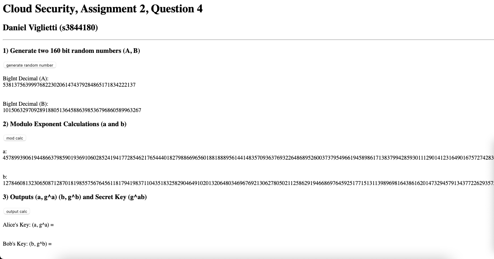

# INTE2401-DiffieHellman

Cloud Security, Assignment 2, Question 4

Author: Daniel Viglietti s3844180

Date: 24/04/2022

JavaScript Web Interface for Diffie-Hellman Key Exchange

Dependencies: BigInteger.js library

## Implement a random 160-bit number generation

Press the button to run the script that generates two random 160-bit numbers (A and B), and it will then output that onto the web page for you and save it as a variable.

## Crypto Library Mod Exponent Calculation

Press the button to run the script that performs the Mod Exponent calculations to generate Alice and Bob's keys (a and b), which will then output it to the web page and save them as variables.

## Output Alice/Bob Keys and Secret Keys

Finally, the third button will generate the shared secret key as well as Alice and Bob's personal keys.

